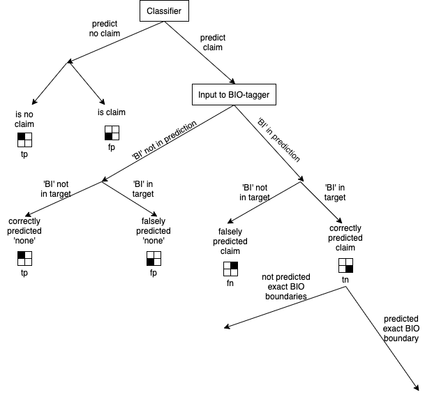
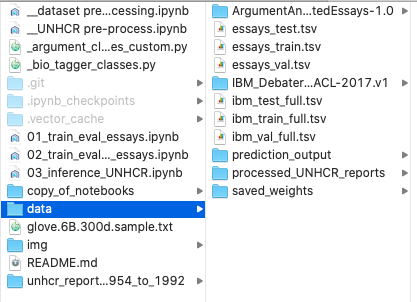

# Mining Claims in UNHCR reports / A2

This is the code for our project for the class Opinion and Argument Mining.

Nico Manthey  

Liubov Karpova  

Luise Strietzel  

The task we set ourselves was to build a model that predicts claims in unlabelled data. We chose to implement the system described in the paper "<b>Joint RNN Model for Argument Component Boundary Detection</b>" https://arxiv.org/abs/1705.02131, though we made some adjustments.

The general computation graph of the system is to train a classifier to classify sentences with and without argument components (e.g. claims), and feed the sentences that were categorized as claims to a BIO-tagger (see the following image). 

# Datasets
We use the Persuasive Essays Dataset, obtained from: 

https://www.informatik.tu-darmstadt.de/ukp/research_6/data/argumentation_mining_1/argument_annotated_essays/index.en.jsp

And the IBM Claim Stance dataset, obtained from:

https://www.research.ibm.com/haifa/dept/vst/debating_data.shtml

# Instructions how to run the code

Our code was build and tested only with the following versions of python packages:
- python == 3.7.1
- spacy == 2.2.4
- pytorch = 1.4.0
- torchtext = 0.4.0
- scikit-learn == 0.22.1
- numpy == 1.18.2
- pandas == 0.25.0
- Also we used spacy's en_core_web_sm which can be downloaded by typing in the terminal: python -m spacy download en_core_web_sm

Since the files are too large, we uploaded our complete work to the following link:

www.test-page.de

The linked folder looks like this:

Our code is to be checked by reading / running the following notebooks:
- 01_train_eval_essays  (training and evaluating our model on essays dataset for 200 epochs).
- 02_train_eval_IBM_essays (trainng and evaluating our model on IBM and essays data combined for 100 epochs, saving model).
- 03_inference_IBM_essays (loading the saved model from 02 and perform inference on UNHCR data).

The evaluation output of when the notebooks were executed is still contained in the notebooks. To not loose the printed output when re-running the code we have provided a copy of the notebooks in the folder "copy_of_notebooks".

The folder "data" contains:
- IBM and Persuasive Essays dataset (original form, as downloaded from source).
- IBM and Persuasive Essays dataset (tsv files, tokenized, labelled, BIO-tagged), obtained by running the notebook "__dataset pre_processing.ipynb".
- UNHCR reports (tsv files, html-tags removed, tokenized), obtained by running the notebook "__UNHCR pre-process.ipynb".
- saved parameters from training model from notebook 02 for 100 epochs.
- output of inference on UNHCR reports (as html file) using model from notebook 02.

