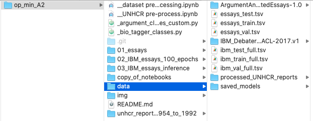

# Mining Claims in UNHCR reports / A2

This is the code for our project for the class Opinion and Argument Mining.

Nico Manthey
Liubov Karpova
Luise Strietzel

The task we set ourselves was to build a model that predicts claims in unlabelled data. We chose to implement the system described in the paper "Joint RNN Model for Argument Component Boundary Detection" https://arxiv.org/abs/1705.02131, though we made some adjustments.

The general computation graph of the system is to train a classifier to classify sentences with and without argument components (e.g. claims), and feed the sentences that were categorized as claims to a BIO-tagger (see the following image). 

# Instructions how to run the code

Since the files are too large, we uploaded our complete work to the following link:

www.test-page.de

The linked folder looks like this:

Our code is to be checked by reading / running the following notebooks:
- 01_train_eval_essays  (training and evaluating our model on essays dataset for 200 epochs)
- 02_train_eval_IBM_essays (trainng and evaluating our model on IBM and essays data combined for 100 epochs, saving model)
- 03_inference_IBM_essays (loading the saved model from 02 and perform inference on UNHCR data)

The folder data contains:
- IBM and Persuasive Essays dataset (original form, as downloaded from source)
- IBM and Persuasive Essays dataset (tsv files, tokenized, labelled, BIO-tagged)
- UNHCR reports (tsv files, html-tags removed, tokenized)
- saved parameters from training model for 100 epochs
- output of inference on UNHCR reports (as html file)

